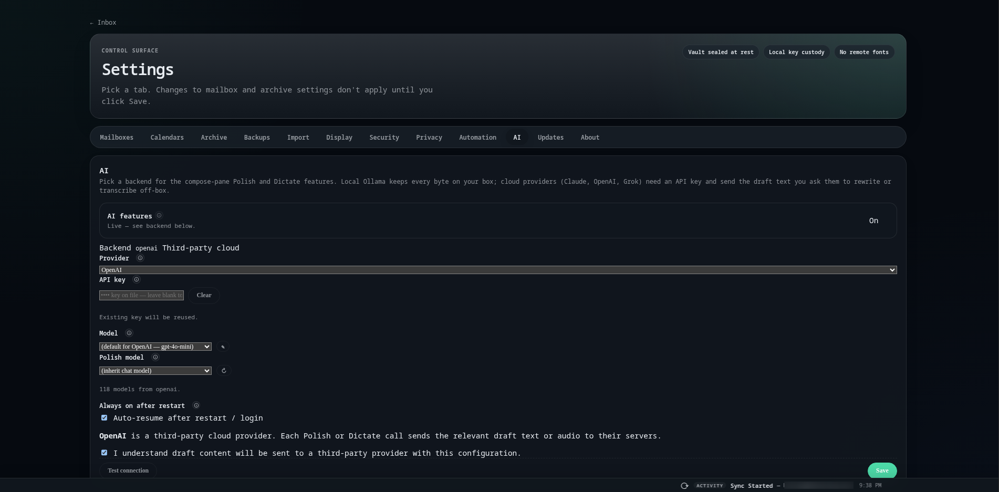
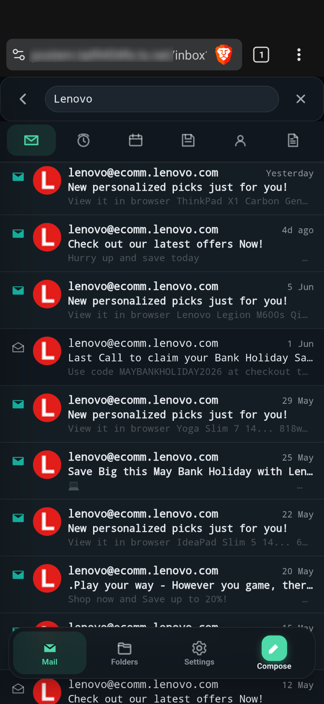

# Postern

## Why Postern

Postern is a Proton-style email client for people who don't want to
hand their keys to a provider. Your PGP private keys live on your
own machine — never on someone else's server — and
[Autocrypt](https://autocrypt.org) handles key exchange between you
and the people you write to, quietly and automatically.

It's a **client**, not a mail server. Postern keeps using whichever
IMAP provider you already have (Gmail, Fastmail, iCloud, anything),
and adds a private layer on top: encrypted local storage, your own
keys, and a UI you actually own.

If you want, Postern can pull **every** message off that provider
and store the only copy in your own SQLCipher-encrypted vault —
leaving nothing behind on Gmail, Fastmail, or wherever you came
from. After that, the provider becomes a relay: ferrying new mail
in and out while the archive lives on your hardware, not theirs.

Combine that with PGP and anything you send to another PGP user
(another Postern, Thunderbird, ProtonMail, anyone Autocrypt-aware)
is encrypted end-to-end. Your provider sees ciphertext and routing
headers — they can't read the body, and neither can anyone watching
the wire between them.

Reach it from anywhere over the free [Tailscale](https://tailscale.com)
mesh — no open ports, no public DNS, no monthly subscription, and
none of the "trust us" you get with a hosted service.

## What you get

-   :material-key-variant:{ .lg .middle } __Your keys, never theirs__

    ---

    PGP private keys live on your box. Autocrypt does the handshake
    with the people you email, so encryption "just works" between
    Postern users and any Autocrypt-compatible client.

-   :material-server-network:{ .lg .middle } __Bring any provider__

    ---

    Gmail, Fastmail, iCloud, your own Postfix — anything that speaks
    IMAP and SMTP. Postern doesn't replace your mail flow, it
    replaces the client reading it.

-   :material-shield-lock:{ .lg .middle } __Private by default__

    ---

    SQLCipher-encrypted vault on disk. Remote access over Tailscale's
    WireGuard mesh — no inbound ports, no exposed DNS. Free for
    personal use.

-   :material-currency-usd-off:{ .lg .middle } __No subscription__

    ---

    One-off Pro license or the Apache-2.0 Community build. No
    per-mailbox fees, no recurring billing, no "Plus tier required
    for X." Your hardware, your bill.

## AI, only if you want it

{ loading=lazy }

AI in Postern is **opt-in and off by default**, and we keep it
deliberately simple for privacy. The everyday tools are the modest
ones: **voice dictation** for hands-free writing, a
**"polish this" rewrite** that cleans up just the selected text,
and Harper-powered grammar and spell check. Nothing turns on until
you switch it on.

By default these run on [Ollama](https://ollama.com) on your own
machine — fully local, nothing leaves the box. If you'd rather use
a hosted model for speed or size, Postern also speaks the OpenAI
API and compatible endpoints (Anthropic, OpenRouter, your own
proxy); you bring the key, and the settings make it obvious when a
feature would send text off your server. Power users can enable a
local mailbox assistant (**Datas**) on top, but the simple,
private defaults are the point.

## On any device

Postern is responsive top to bottom. Same inbox, same keys, same
encrypted vault — whether you're on a desktop, laptop, or phone
connected over Tailscale. Sender chips, folder counts, and search
all carry across.

## Two editions

|                                       | **Postern Pro**                                | **Postern Community** |
| ------------------------------------- | ---------------------------------------------- | --------------------- |
| License                               | Paid (one-off, lifetime install, 3 yrs updates) | Apache 2.0            |
| Mailbox cap                           | Unlimited                                      | 3                     |
| Tailscale + remote access             | Yes                                            | No (localhost-only)   |
| Trusted-device sessions               | Yes                                            | No                    |
| AI assist (dictation, polish; opt-in) | Yes                                            | No                    |
| VPN kill-switch (NordVPN / Mullvad)   | Yes                                            | No                    |
| Updates                               | Signed releases, in-app installer               | `git pull && ./install.sh --update` |

[Buy a Pro license](https://billing.postern.email){ .md-button .md-button--primary }
[Community source](https://github.com/dazller4554328/postern-community){ .md-button }

## Start here

- [Install Postern](install/index.md) — Tailscale-native path,
  ~10–15 minutes from a clean Ubuntu box.
- [Home server install](install/home-server.md) — same path on a
  NUC, mini-PC, or Pi 5 you already own.
- [Community edition](install/community.md) — OSS build,
  localhost-only.
- [Reference](reference/index.md) — storage invariants, migration
  paths, the bits worth knowing.
