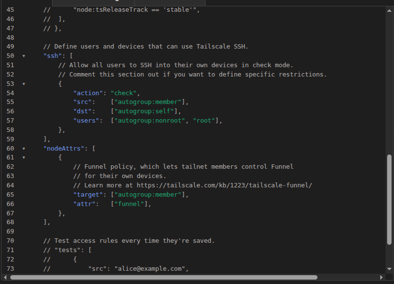

# Install Postern

Three steps:

1. **Pick a host** that meets the system requirements.
2. **Install Tailscale** on the host (this is how you'll reach
    Postern from your phone).
3. **Install Postern** with the one-liner installer.

Whole process is ~10–15 minutes on a clean Ubuntu VPS.

---

## 1. System requirements

| | Minimum | Recommended |
|---|---|---|
| **OS** | Ubuntu 22.04 / 24.04 LTS, Debian 12 | Ubuntu 24.04 LTS |
| **CPU** | 2 vCPU | 4 vCPU |
| **RAM** | 2 GB (with 4 GB swap) | **4 GB** |
| **Disk** | 20 GB | 40 GB+ |
| **Architecture** | x86_64 | x86_64 |
| **Internet** | Outbound only | — |

The first-time Rust build is the spike — peaks around 2.5–3 GB. On
a 2 GB box add swap before installing or it'll OOM mid-build.

**Where to host:**

- **Hetzner CX22** — 4 GB / 40 GB / 2 vCPU, ~€4/month. Best value.
- **Netcup VPS 1000 G11s** — 4 GB / 128 GB / 2 vCore, ~€5/month.
- **Netcup VPS 2000 G11s** — 8 GB / 256 GB / 4 vCore, ~€8/month.
  Faster install, room for AI features.
- **Home server / NUC / Pi 5 (8 GB)** — see the
  [home-server guide](home-server.md). Same install path; you
  supply the always-on hardware.

You'll also need:

- A free **[Tailscale account](https://login.tailscale.com)** (the
  personal tier is free for up to 100 devices).
- A **[Postern Pro license](https://billing.postern.email)** —
  format `PSTN-XXXX-XXXX-XXXX-XXXX`. (Or use the
  [Community Edition](community.md) if you don't need remote
  access.)
- An **email account** with IMAP + SMTP enabled. Gmail (with an
  [app password](../guides/gmail-app-password.md)),
  Fastmail, iCloud, ProtonMail (via Bridge), or any IMAP host.

---

## 2. Install Tailscale on the host

Postern reaches your devices through Tailscale's encrypted mesh —
no public DNS, no port-forwarding. Tailscale also handles the HTTPS
certificate, so there's nothing to configure in Apache / Caddy /
Cloudflare.

**Every step in this section is required.** Funnel (for reaching
Postern from outside your tailnet) is covered separately later, and
is the only optional piece of the Tailscale setup.

### 2a. Install + log in

SSH into your host and run:

```bash
curl -fsSL https://tailscale.com/install.sh | sh
sudo tailscale up
```

The `tailscale up` command prints a one-time URL. Open it in a
browser, authenticate with your Tailscale account, and the host
joins your tailnet.

Confirm:

```bash
tailscale ip -4              # prints your tailnet IP (100.x.y.z)
tailscale status             # lists peer devices on your tailnet
```

### 2b. Enable MagicDNS + HTTPS

One click in the admin: [admin/dns][ts-dns] → toggle on. This makes
the host reachable at a friendly hostname and gives it an automatic
HTTPS certificate.

### 2c. Generate an auth key

Postern's container needs a Tailscale auth key to join the tailnet
on first boot.

1. Open [admin/settings/keys][ts-keys].
2. *Generate auth key…* → tick **Reusable** + **Ephemeral**, leave
   tags empty, click **Generate**.
3. Copy the `tskey-auth-...` value — section 3 will prompt for it.

---

## 3. Install Postern

Still in the host's SSH session, run the license-gated installer:

```bash
curl -fsSL https://updates.postern.email/install.sh \
  | sudo LICENSE=PSTN-XXXX-XXXX-XXXX-XXXX bash
```

Replace `PSTN-XXXX-XXXX-XXXX-XXXX` with the license key from your
[billing portal](https://billing.postern.email).

The bootstrap script:

1. Validates the license against `updates.postern.email`.
2. Downloads the signed Pro release tarball.
3. Verifies the Ed25519 signature against the embedded public key —
   if the signature doesn't match, the install aborts before
   anything is extracted.
4. Stages the tree into `/opt/postern` and runs the in-tree
   installer.

You'll then be prompted for the **Tailscale auth key** from step 2
(`tskey-auth-...`).

The script:

1. Installs Docker if missing (apt / dnf / pacman as appropriate).
2. Builds the Postern image — first build takes ~3 minutes on a
   4 GB box, faster on subsequent runs because of cargo's cache
   mount.
3. Brings up the Postern container + the Tailscale sidecar.
4. Prints the URL it's now reachable at — looks like
   `https://postern.<your-tailnet>.ts.net`.

**Open that URL in any browser** on a device that's also on your
tailnet (your phone, laptop, etc.). You'll see Postern's first-boot
screen.

---

## 4. First-boot setup

The browser is now showing Postern's landing flow.

1. **Set your master password.** This derives the encryption key
    for the SQLCipher vault. Postern *never* stores it — Argon2id
    derives it on every unlock. **If you forget it, your data is
    unrecoverable.** Save it in your password manager before
    proceeding.
2. **Add your first mailbox.** The wizard prefills IMAP/SMTP host
    + port for Gmail, Fastmail, iCloud, ProtonMail (via Bridge).
    For Gmail you'll need an
    [app password](../guides/gmail-app-password.md) —
    your normal account password won't work because Google requires
    OAuth or app-passwords for IMAP.
3. **Activate your license** in *Settings → Updates*. The key you
    passed to the bootstrap is already pre-filled — just click
    **Activate** to bind it to this install. *Updates valid through
    DATE* should appear.

Initial IMAP sync runs in the background. Empty mailbox = seconds.
A decade of Gmail = an hour or two. Watch the unread badge tick up
in the sidebar.

---

## 5. (Optional) Reach Postern from anywhere with Funnel

**Skip this section** unless you want anyone with the URL to reach
Postern from any network — coffee shop wifi, a friend's laptop,
your phone over cellular without Tailscale installed. By default
Postern is only reachable from devices that are on your tailnet,
which is usually exactly what you want.

If you do want public reach, two things have to happen:

### 5a. Authorise Funnel in your tailnet ACL

Open [login.tailscale.com/admin/acls/file][ts-acl] and add a
`nodeAttrs` block that lets tailnet members enable Funnel on their
own devices. Paste this somewhere inside the top-level object
(alongside `acls`, `tagOwners`, `ssh`, etc.):

```hujson
"nodeAttrs": [
  {
    "target": ["autogroup:member"],
    "attr":   ["funnel"],
  },
],
```

It should end up looking like this in the editor:

{ loading=lazy }

Click **Save**. If `nodeAttrs` already exists for something else,
add the funnel object inside the existing array instead of
duplicating the key.

### 5b. Restart the Tailscale sidecar

The sidecar already ships with Funnel enabled in its serve config
(`AllowFunnel` in `deploy/docker/tailscale/serve.json`); it just
needs a restart to re-read the policy now that your ACL grants the
funnel attribute.

```bash
sudo docker restart postern-tailscale-1
```

After it comes back up (~10 seconds), the same
`https://postern.<your-tailnet>.ts.net` URL is reachable from any
browser on any network — phones in coffee shops, friends' laptops,
anywhere. Devices on your tailnet keep the direct connection;
everyone else goes via Tailscale's funnel infrastructure with
HTTPS.

Verify:

```bash
sudo docker exec postern-tailscale-1 tailscale funnel status
# expect: postern.<tailnet>.ts.net (Funnel on)
#           |-- / proxy http://postern:8080
```

If `funnel status` still says off, your ACL change in 5a hasn't
taken effect yet — return to [admin/acls/file][ts-acl] and confirm
the `nodeAttrs` block was saved (Tailscale's "Save" button is grey
when there are no pending changes; if it's coloured, you haven't
saved).

The same `https://postern.<your-tailnet>.ts.net` URL is now
reachable from any browser on any network. Devices on your tailnet
keep the direct connection; everyone else goes via Tailscale's
funnel infrastructure with HTTPS.

---

## 6. Day-2 operations

| Task | How |
|---|---|
| **Apply an update** | *Settings → Updates → Install update.* Postern verifies the Ed25519 signature, runs the host-side updater, restarts. |
| **Back up the vault** | *Settings → Backups.* Encrypted DB ships to S3 / B2 / SFTP / Google Drive on the schedule you pick. |
| **View container logs** | `sudo docker logs --tail 200 postern-postern-1` |
| **Tailscale status** | `sudo docker exec postern-tailscale-1 tailscale status` |
| **Reissue license** *(rebuilt the host)* | WHMCS portal → your service → **Reissue license**. Then re-paste the key in *Settings → Updates*. |

---

## Troubleshooting

??? failure "Funnel says 'not enabled for this tailnet'"

    Tailnet ACLs don't ship with Funnel granted by default — you
    have to add the `nodeAttrs` entry yourself. Open
    [admin/acls/file][ts-acl] and confirm this block is present
    inside the top-level object:

    ```hujson
    "nodeAttrs": [
      { "target": ["autogroup:member"], "attr": ["funnel"] },
    ],
    ```

    Save, then restart the sidecar so it re-reads the policy:

    ```bash
    sudo docker restart postern-tailscale-1
    ```

??? failure "Funnel proxies to localhost:8080 instead of postern:8080"

    You ran `tailscale funnel --bg --https=443 http://localhost:8080`
    inside the sidecar at some point — that command overwrites the
    shipped `serve.json` and points Funnel at the sidecar's own
    loopback (which has nothing on it), instead of the Postern
    container reachable via Docker DNS at `http://postern:8080`.

    To recover, wipe the sidecar's persisted config so it falls back
    to `serve.json` on next boot:

    ```bash
    sudo docker rm -f postern-tailscale-1
    sudo docker volume rm postern_tailscale-state
    sudo docker compose -f /opt/postern/deploy/docker/docker-compose.yml \
      --env-file /opt/postern/.env --profile tailscale up -d tailscale
    ```

    **Don't run `tailscale funnel ...` from the host.** The shipped
    `serve.json` already has `AllowFunnel` set; restarting the
    sidecar is all that's needed once the ACL is in place.

??? failure "First boot OOMs / build aborts on a 2 GB box"

    Add 4 GB swap before re-running the installer:

    ```bash
    sudo fallocate -l 4G /swapfile && sudo chmod 600 /swapfile
    sudo mkswap /swapfile && sudo swapon /swapfile
    echo '/swapfile none swap sw 0 0' | sudo tee -a /etc/fstab
    ```

??? failure "License rejected ('No such license' / 'Malformed')"

    Confirm the key matches your WHMCS client area exactly:
    case-sensitive, no leading/trailing whitespace, no smart-quote
    glyphs from a clipboard mishap. Keys are 24 chars total, all
    A–Z 2–9 (no 0/O, 1/I/L).

??? failure "Tailscale auth-key prompt loops"

    Auth keys are single-use unless you ticked **Reusable** when
    generating. Generate a fresh one in
    [admin/settings/keys][ts-keys] and re-run
    `sudo /opt/postern/deploy/install.sh`.

If you hit something not listed here, file an issue at
[github.com/dazller4554328/postern-community](https://github.com/dazller4554328/postern-community).

[ts-dns]: https://login.tailscale.com/admin/dns
[ts-acl]: https://login.tailscale.com/admin/acls/file
[ts-keys]: https://login.tailscale.com/admin/settings/keys
